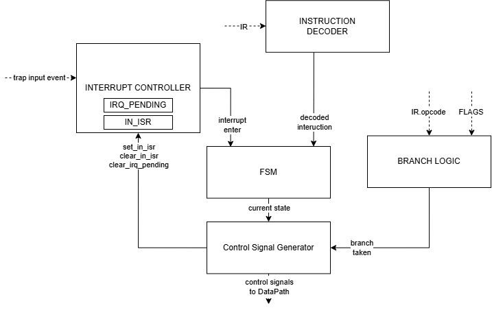
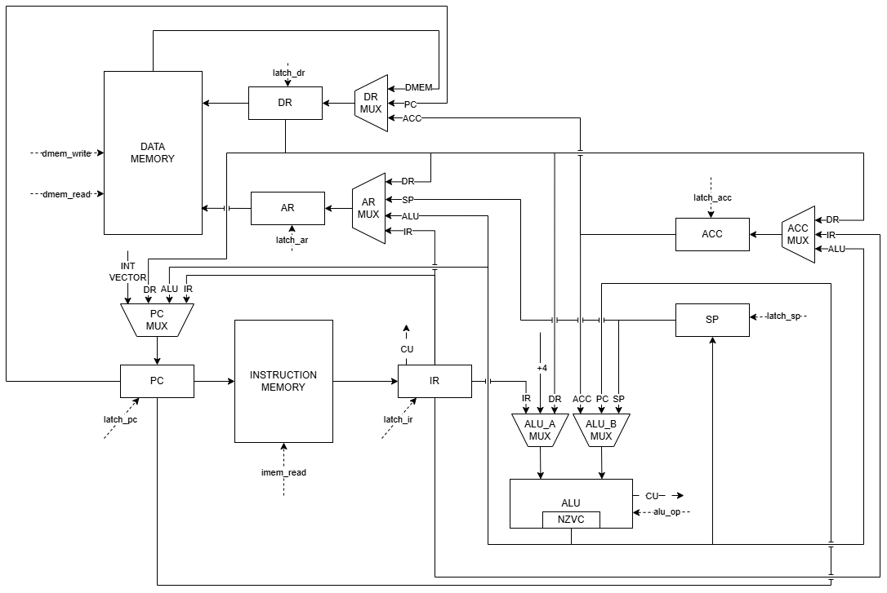

### Отчет по Лабораторной работе №4

- **ФИО:** `Сарваров Тимур Фазаелович`
- **Группа:** `P3213`
- **Вариант:** `lisp | acc | harv | hw | tick | binary | trap | mem | cstr | prob1`

Усложнения не реализуются.

---

## Язык программирования: Lisp-like

Язык представляет собой небольшой Lisp-подобный язык с глобальными константами, переменными,
буферами, функциями, циклами, условными выражениями, прямым доступом к памяти и обработчиком
прерывания ввода.

### Форма Бэкуса-Наура (БНФ)

```text
program ::= top_level_form*

top_level_form ::= defconst
                 | defvar
                 | defbuffer
                 | defun
                 | on_input

defconst  ::= "(" "defconst" symbol literal ")"
defvar    ::= "(" "defvar" symbol literal ")"
defbuffer ::= "(" "defbuffer" symbol integer ")"
defun     ::= "(" "defun" symbol "(" symbol* ")" expr+ ")"
on_input  ::= "(" "on-input" expr+ ")"

expr ::= atom
       | begin
       | setq
       | if
       | while
       | arithmetic
       | compare
       | memory
       | function_call

atom ::= literal | symbol

literal ::= integer
          | char
          | string

begin ::= "(" "begin" expr+ ")"
setq  ::= "(" "setq" symbol expr ")"
if    ::= "(" "if" expr expr expr ")"
while ::= "(" "while" expr expr+ ")"

arithmetic ::= "(" arithmetic_op expr expr ")"
arithmetic_op ::= "+" | "-" | "*" | "/" | "mod"

compare ::= "(" compare_op expr expr ")"
compare_op ::= "=" | "!=" | "<" | ">" | "<=" | ">="

memory ::= "(" "mem-get" expr ")"
         | "(" "mem-set" expr expr ")"

function_call ::= "(" symbol expr* ")"

integer ::= ["-"] digit+
char    ::= "'" literal_char "'"
string  ::= '"' literal_char* '"'
symbol  ::= letter (letter | digit | "_" | "?" | "!")*
```

### Семантика

- Все выражения вычисляются строго и оставляют результат в `ACC`.
- `begin` вычисляет выражения последовательно, результатом является последнее выражение.
- `if` считает нулевое значение ложью, любое ненулевое значение истиной.
- `while` возвращает `0`.
- `defconst` и `defvar` размещаются в Data Memory; константы не защищаются аппаратно, но
  транслятор запрещает `(setq CONST ...)`.
- `defbuffer` выделяет последовательность 32-битных слов и при обращении как к символу возвращает
  базовый адрес буфера.
- Строки хранятся как C string: символы по одному 32-битному слову и завершающий ноль.
- `mem-get` и `mem-set` работают с обычными адресами Data Memory. Адреса MMIO не являются
  специальными словами языка.
- Аргументы функций вычисляются слева направо, кладутся на стек, результат функции возвращается
  через `ACC`.
- `on-input` задает обработчик аппаратного trap-ввода. Если он отсутствует, транслятор генерирует
  обработчик по умолчанию.

---

## Организация памяти и регистры

- **Архитектура памяти:** Гарвардская (`harv`): Instruction Memory и Data Memory разделены.
- **Адресация:** байтовая.
- **Instruction word:** 32 бита.
- **Data word:** 32 бита.
- **Instruction address step:** 4 байта.
- **Data Memory:** `0x000000..0x3FFFFF` (`2^22` байта).
- **Stack start:** `SP = 0x400000`. Стек растет вниз.
- **Interrupt vector:** `0x000004`.

### Начальное состояние регистров

| Регистр | Начальное значение | Назначение |
| :--- | :---: | :--- |
| `PC` | `0x000000` | Адрес текущей инструкции |
| `IR` | `HALT` | Регистр инструкции |
| `AR` | `0` | Адрес для Data Memory |
| `DR` | `0` | Буфер данных Data Memory |
| `ACC` | `0` | Аккумулятор |
| `SP` | `0x400000` | Указатель стека |
| `FLAGS` | `N=0;Z=1;V=0;C=0;` | Флаги результата ALU |
| `IN_ISR` | `0` | Признак нахождения в обработчике |
| `IRQ_PENDING` | `0` | Запрошено прерывание ввода |

### Instruction Memory

Первые две инструкции задаются соглашением архитектуры и транслятора:

```text
0x000000 : JMP main
0x000004 : JMP input_handler
0x000008 : остальной код
```

Общая схема Instruction Memory:

```text
Instruction memory
+------------------------------------------------+
| 0x000000 : JMP main                            |
| 0x000004 : JMP input_handler                   |
| 0x000008 : function code / program code        |
| ...                                            |
| main     : main program                        |
| ...                                            |
| handler  : interrupt handler                   |
+------------------------------------------------+
```

Если форма `on-input` отсутствует, транслятор добавляет:

```asm
default_input_handler:
    LOAD #0
    STORE <mmio.input_status>
    IRET
```

### Data Memory

Алгоритм размещения статических данных:

1. Все MMIO-адреса из `machine_config.json` считаются занятыми.
2. Program data начинается с первого свободного адреса после MMIO-области, выровненного по 4.
3. `defconst`, `defvar`, `defbuffer`, строковые литералы и служебные ячейки размещаются подряд.
4. Program data не пересекается с MMIO-адресами.

Общая схема Data Memory для стандартного MMIO-конфига:

```text
Data memory
+------------------------------------------------+
| 0x000000 : IO_IN                               |
| 0x000004 : IO_STATUS                           |
| 0x000008 : IO_OUT                              |
| 0x00000C : IO_OVERRUN                          |
| 0x000010 : program data                        |
|            defconst, defvar, defbuffer, cstr   |
| ...                                            |
|            free memory                         |
| ...                                            |
| 0x3FFFFC : stack                               |
+------------------------------------------------+
```

Пример MMIO-конфига:

```json
{
  "mmio": {
    "input_data": 0,
    "input_status": 4,
    "output_data": 8,
    "input_overrun": 12
  }
}
```

Смысл MMIO-регистров:

| Имя | Адрес в примере | Назначение |
| :--- | :---: | :--- |
| `input_data` | `0` | Последний пришедший символ |
| `input_status` | `4` | `1`, если символ ожидает обработки |
| `output_data` | `8` | Запись символа в вывод |
| `input_overrun` | `12` | Флаг переполнения ввода |

---

## Система команд (ISA)

Архитектура аккумуляторная (`acc`): арифметические и загрузочные команды работают через `ACC`.

### Формат инструкции

```text
31        24 23      22 21                         0
+-----------+----------+----------------------------+
|  opcode   |   mode   |          operand           |
+-----------+----------+----------------------------+
   8 бит       2 бита             22 бита
```

Кодирование:

```python
word = (opcode << 24) | (mode << 22) | (operand & 0x3FFFFF)
```

Бинарный файл содержит настоящие 32-битные big-endian слова.

### Режимы адресации

| Mode | Название | Обозначение | Семантика |
| ---: | :--- | :--- | :--- |
| `00` | immediate | `#x` | значение `x` |
| `01` | absolute | `x` | `DMEM[x]` |
| `10` | indirect | `@x` | `DMEM[DMEM[x]]` |
| `11` | stack-relative | `sp+x` | `DMEM[SP + x]` |

### Набор инструкций

Такты указаны как полный цикл исполнения в модели, включая `FETCH_IR`, `FETCH_PC_INC` и `DECODE`.
Для команд с операндом такты зависят от режима адресации.

| Opcode | Mnemonic | Аргумент | Такты | Семантика |
| ---: | :--- | :--- | :---: | :--- |
| `0x00` | `HALT` | нет | 4 | Останов модели |
| `0x01` | `LOAD` | `#x` | 4 | `ACC <- x` |
| `0x01` | `LOAD` | `x`, `sp+x` | 6 | `ACC <- operand_value` |
| `0x01` | `LOAD` | `@x` | 8 | `ACC <- DMEM[DMEM[x]]` |
| `0x02` | `STORE` | `x`, `sp+x` | 6 | `operand <- ACC` |
| `0x02` | `STORE` | `@x` | 8 | `DMEM[DMEM[x]] <- ACC` |
| `0x03` | `ADD` | любой | 4/6/8 | `ACC <- ACC + operand_value` |
| `0x04` | `SUB` | любой | 4/6/8 | `ACC <- ACC - operand_value` |
| `0x05` | `MUL` | любой | 4/6/8 | `ACC <- ACC * operand_value` |
| `0x06` | `DIV` | любой | 4/6/8 | `ACC <- ACC / operand_value` |
| `0x07` | `MOD` | любой | 4/6/8 | `ACC <- ACC mod operand_value` |
| `0x08` | `CMP` | любой | 4/6/8 | `FLAGS <- NZVC(ACC - operand_value)` |
| `0x09` | `JMP` | `addr` | 4 | `PC <- addr` |
| `0x0A` | `BEQ` | `addr` | 4 | Переход, если `Z == 1` |
| `0x0B` | `BNE` | `addr` | 4 | Переход, если `Z == 0` |
| `0x0C` | `BLT` | `addr` | 4 | Переход, если `N != V` |
| `0x0D` | `BLE` | `addr` | 4 | Переход, если `Z == 1 or N != V` |
| `0x0E` | `BGT` | `addr` | 4 | Переход, если `Z == 0 and N == V` |
| `0x0F` | `BGE` | `addr` | 4 | Переход, если `N == V` |
| `0x10` | `PUSH` | нет | 7 | `SP <- SP - 4; DMEM[SP] <- ACC` |
| `0x11` | `POP` | нет | 6 | `ACC <- DMEM[SP]; SP <- SP + 4` |
| `0x12` | `CALL` | `addr` | 7 | Сохранить `PC`, перейти к функции |
| `0x13` | `RET` | нет | 7 | Восстановить `PC` со стека |
| `0x14` | `IRET` | нет | 12 | Восстановить `ACC`, `FLAGS`, `PC`, сбросить `IN_ISR` |
| `0x15` | `DROP` | нет | 4 | `SP <- SP + 4`, `ACC` не меняется |

`STORE #x` запрещен на уровне ISA и модели.

---

## Прерывания и Trap Input

Ввод задается JSON-расписанием:

```json
[
  [10, "h"],
  [100, "i"]
]
```

На каждом такте модель проверяет расписание:

```text
if input_status == 0:
    input_data = char_code
    input_status = 1
    IRQ_PENDING = 1
else:
    input_data = char_code
    input_overrun = 1
```

Если новый символ пришел до обработки старого, он перезаписывает `input_data`, а устройство
выставляет `input_overrun`.

Вход в прерывание выполняется только между инструкциями:

```text
IRQ_PENDING == 1 and IN_ISR == 0
```

При входе в обработчик:

```text
push PC
push FLAGS
push ACC
IN_ISR = 1
IRQ_PENDING = 0
PC = 0x000004
```

Вложенные прерывания не выполняются. Возврат происходит инструкцией `IRET`.

---

## Транслятор

Интерфейс командной строки:

```bash
python -m src.translator <source.lisp> <out.bin> --config <machine_config.json>
```

Пример:

```bash
python -m src.translator examples/hello.lisp build/hello.bin --config examples/machine_config.json
```

Транслятор создает:

```text
out.bin          # настоящий бинарный файл
out.bin.hex      # address - HEXCODE - mnemonic
out.data.json    # начальное состояние Data Memory
out.symbols.json # таблица символов
out.ast.json     # AST
```

Основные этапы трансляции:

1. Лексический разбор и построение AST.
2. Проверка наличия `(defun main () ...)`.
3. Размещение данных с учетом занятых MMIO-адресов.
4. Генерация стартовых векторов `JMP main` и `JMP input_handler`.
5. Компиляция функций и обработчика `on-input`.
6. Разрешение меток.
7. Запись бинарного кода и sidecar-файлов.

---

## Модель процессора

Интерфейс командной строки:

```bash
python -m src.machine <code.bin> <data.json> <input.json> --config <machine_config.json> --log <log.txt> --max-ticks 100000
```

Пример:

```bash
python -m src.machine build/hello.bin build/hello.data.json examples/empty_input.json --config examples/machine_config.json --log build/hello.log --max-ticks 100000
```

Архитектура модели разделена на **Control Unit** и **Data Path**.

### Схема процессора

#### Control Unit



#### Data Path



### DataPath

DataPath содержит:

- регистры `PC`, `IR`, `AR`, `DR`, `ACC`, `SP`, `FLAGS`, `IN_ISR`, `IRQ_PENDING`;
- Instruction Memory;
- однопортовую Data Memory;
- MUX-ы `PC_MUX`, `AR_MUX`, `DR_MUX`, `ACC_MUX`, `FLAGS_MUX`, `ALU_A_MUX`, `ALU_B_MUX`;
- ALU с операциями `ADD`, `SUB`, `MUL`, `DIV`, `MOD`;
- методы защелкивания регистров `latch_pc`, `latch_ir`, `latch_ar`, `latch_dr`,
  `latch_acc`, `latch_sp`, `latch_flags`.

### Control Unit

Control Unit реализован как hardwired FSM. В коде выделены логические блоки:

- `decode_instruction`;
- `evaluate_branch`;
- `evaluate_interrupt`;
- `next_state`;
- `generate_control_signals`.

Каждая инструкция начинается с:

```text
FETCH_IR     : IR <- IMEM[PC]
FETCH_PC_INC : PC <- PC + 4
DECODE       : выбор исполнительного состояния
```

После завершения инструкции CU проверяет возможность входа в прерывание.

### Логирование

Каждый такт пишется отдельной строкой:

```text
TICK 42 | LOAD_MEM | LOAD 0x000010 | PC=0x000020 | AR=0x000010 | DR=7 | ACC=5 | SP=0x3FFFF0 | FLAGS=N0Z0V0C0 | ISR=0 | IRQ=0 | SIGNALS=dmem_read,latch_dr | MEM=dmem_read[0x000010]=7
```

В журнале видны:

- номер такта;
- состояние FSM;
- текущая инструкция;
- регистры;
- флаги;
- факт нахождения в ISR;
- активные управляющие сигналы;
- чтение/запись памяти;
- события ввода/вывода.

---

## Примеры программ

```text
examples/
  hello.lisp
  cat.lisp
  hello_user_name.lisp
  sort.lisp
  fibonacci.lisp
  double_precision.lisp
  prob1.lisp
  interrupts_default_handler.lisp
  interrupt_overrun.lisp
```

`prob1` реализует Euler Problem 4: наибольший палиндром, полученный как произведение двух
трехзначных чисел. Результат: `906609`.

`double_precision` демонстрирует арифметику двойной точности: число `8000000000` хранится и
складывается как два 32-битных слова.

`interrupt_overrun` демонстрирует приход двух символов подряд: второй символ перезаписывает
`input_data`, выставляется `input_overrun`, обработчик выводит уже новый символ.

---

## Тестирование через Golden Tests

Команда запуска:

```bash
pytest -v
```

Golden-файлы находятся в `golden/`. Каждый golden содержит:

- полный исходный код в поле `source`;
- конфигурацию MMIO;
- входное расписание;
- полный дизассемблированный `machine_code_hex`;
- полное начальное состояние `data_memory`;
- потактовый `log_excerpt`;
- ожидаемый вывод.

Проверяемые сценарии:

| Golden | Что проверяет | Вывод | Такты |
| :--- | :--- | :--- | ---: |
| `hello` | Посимвольный вывод через MMIO | `Hello\n` | 416 |
| `cat` | Ввод через trap и `on-input` | `abc` | 1000* |
| `hello_user_name` | Диалог, буфер, строки, прерывания | `What is your name?\nHello, Alice!\n` | 9286 |
| `sort` | Работа с буфером и сортировка | `123\n` | 4423 |
| `recursive_factorial_or_fibonacci` | Рекурсия | `8\n` | 3051 |
| `double_precision` | 64-битное число как два слова | `8000000000\n` | 1845 |
| `prob1` | Euler Problem 4 | `906609\n` | 1589019 |
| `interrupts_default_handler` | Автогенерация default handler | пустой вывод | 10000* |
| `interrupt_overrun` | Перезапись входа при overrun | `b` | 500* |

`*` Сценарий намеренно не завершает программу инструкцией `HALT`; модель останавливается по лимиту
тиков golden-теста.

### Unit-тесты

Unit-тесты покрывают:

- парсер: формы грамматики, вложенные выражения, строки и escape-последовательности;
- ISA: кодирование/декодирование инструкций, режимы адресации, signed immediate, ошибки;
- транслятор: арифметику, данные, вызовы функций, AST/HEX sidecar, `on-input`, default handler;
- DataPath: MUX-ы, защелки регистров, ALU, флаги, Data Memory и MMIO;
- ControlUnit: fetch cycle, decode, branches, interrupts, FSM transitions;
- Machine: режимы адресации, арифметику, стек, `CALL/RET`, `IRET`, MMIO, trap input, overrun.

---

## CI

Добавлен workflow:

```text
.github/workflows/ci.yml
```

Он запускает:

```bash
python -m compileall src tests
python -m ruff check .
python -m mypy src tests
pytest -v
```

Локальная проверка:

```text
All checks passed!
Success: no issues found in 17 source files
26 passed
```
